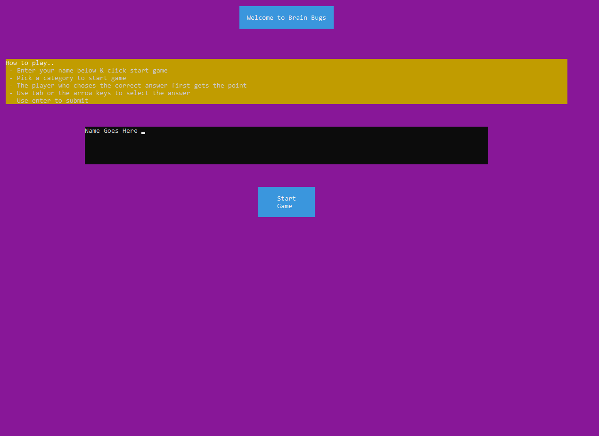
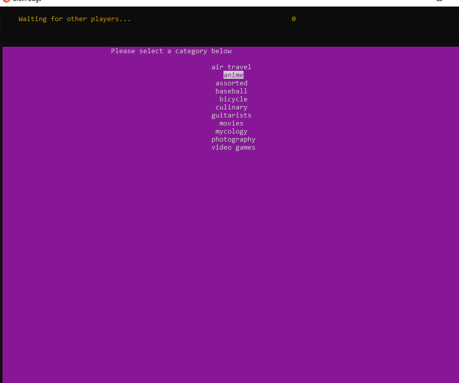
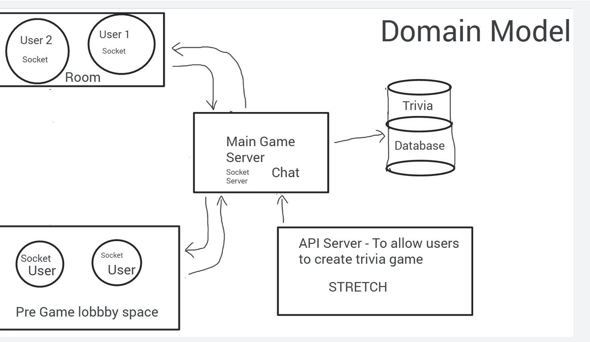
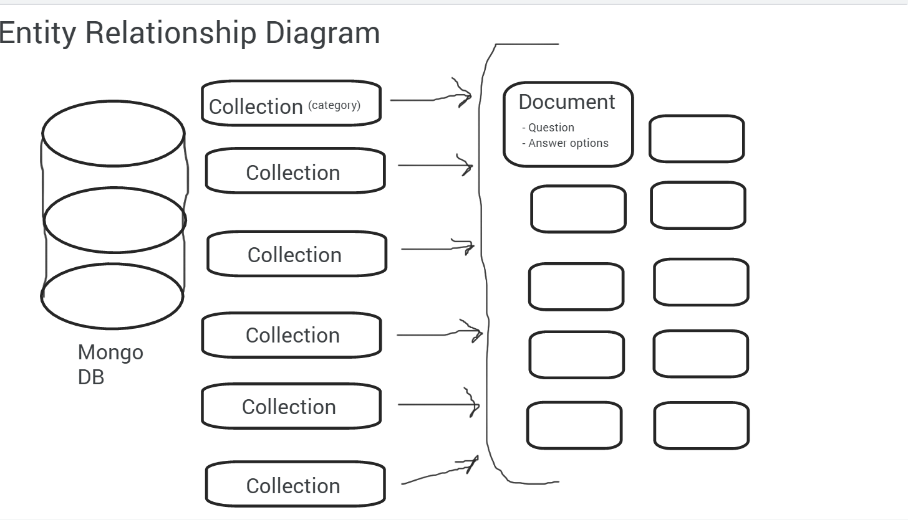
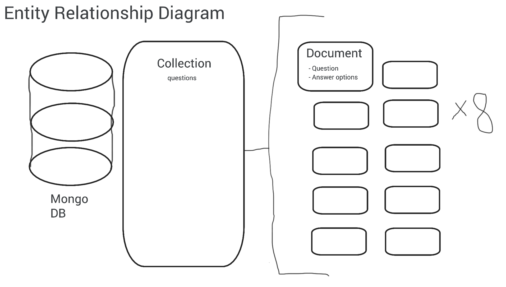
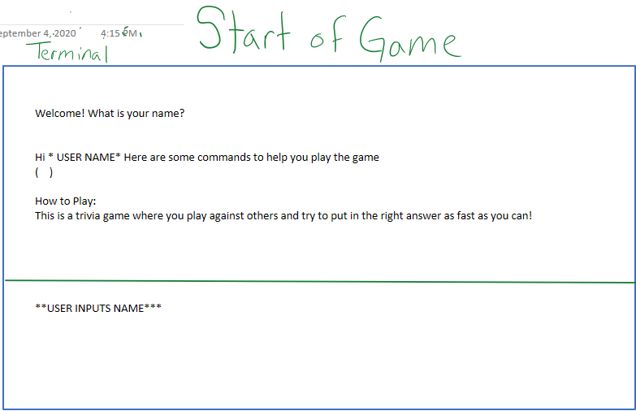
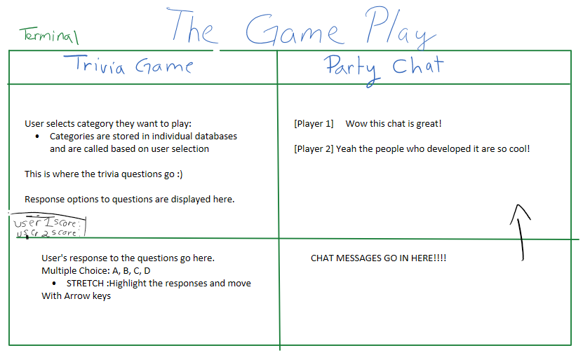
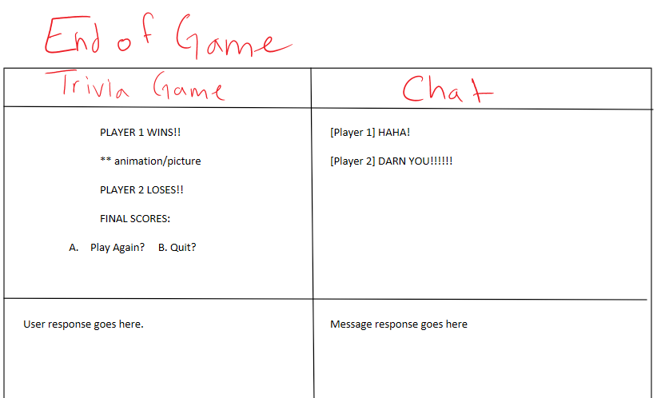

# Brain Bugs
## Created by this.group

## We are Deployed On
https://brain-bugs.herokuapp.com/

## Web Application
This application consists of a backend written with JavaScript utilizing Node.js. It also incorporates the Express and Blessed libraries and the Socket.io client.

This is a command line multi-player trivia game. Players will have the opportunity to join a room with their friend, choose a category of trivia questions, and play against each other to win. You can chat with the other player to figure out what category you want to play and interact with them throughout the game. There are 10 questions per category and the player who answers correctly fastest gets the point! The winner's name is displayed on the end game screen and you win bragging rights of how smart you are!

## Version
12.0.0

## Tools
- VS Code
- Node.js
- Express
- Blessed
- dotenv
- socket.io
- socket.io-client <br>
(etc)

## Getting Started
Clone this repository to your local machine.

``` git clone https://github.com/this-dot-group/midterm-project.git```

Once downloaded, open two terminals and go into the game and chat folders and install all dependencies.

``` cd lib/game ```

``` npm i ```

``` cd lib/chat```

``` npm i ```

Start the game by running node on each folder.

``` node . ```

## Usage

### Enter your name on start page and start game



### Select a category



### Answer the questions


### Send a chat


## Data Model
### Overall Project Schema
``` 
topic="" 
question="" 
answers:='[{
  "answer":"", "correct":},
  {"answer":"","correct":},
  {"answer":"","correct":},
  {"answer":"","correct":}]'
```

## Data Flow
 - User connects to server by using “node .”.
 - Command-line prompts a welcome message and asks for user input of name.
 - Instructions on how to play are displayed.
 - User joins the main game and chat room, when users send a chat the other player can see it on their screen.
 - Users can choose a trivia category to play against other players. The trivia data is pulled from an individual MongoDB database.
 - When the category is selected the first question is sent out to player terminals.
 - The player who answers correctly first gets a point, if they answer first and are incorrect the other player has the oppurtunity to answer. If no one answers correctly the game displays next question and no points are awarded.
 - After each question, the terminal displays an updated score.
 - When all the questions from the database collection are exhausted game over.
 - When the game ends the winner's name is displayed and the players can exit the game.

## Domain Model


## Entity Relationship Diagram



## Project Board
[Trello](https://trello.com/b/bAkFn6ZU/project-board) 
<br>
*User Stories included*

## Wireframes




## Authors
- Chris Hamersly: [GitHub](https://github.com/christopherhamersly)
- Daisy Johnson: [GitHub](https://github.com/daisyjanejohnson) 
- Tia Low: [GitHub](https://github.com/TiaLow)
- Joshua Williams: [GitHub](https://github.com/jswill88)
